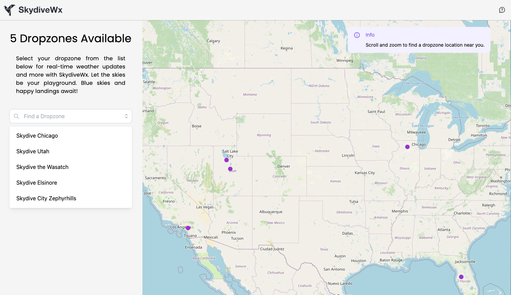

# SkydiveWx

SkydiveWx app developed in Python with the [Plotly Dash](https://dash.plotly.com/) framework.



## Development

To build the package, run the following command:

```bash
pip install .
```

For development and to view any live changes, run the app locally with the following command:

_**Note:** If changes do not appear on refresh, please delete all `/build` and `*.egg-info` files, then rebuild the package._

```bash
python src/skydiveutahapp/app.py
```

## Production Settings

Make sure that the following environment variables are exported:

- **`GOOGLE_ANALYTICS_ID`**: _ID of your Google Analytics property_
